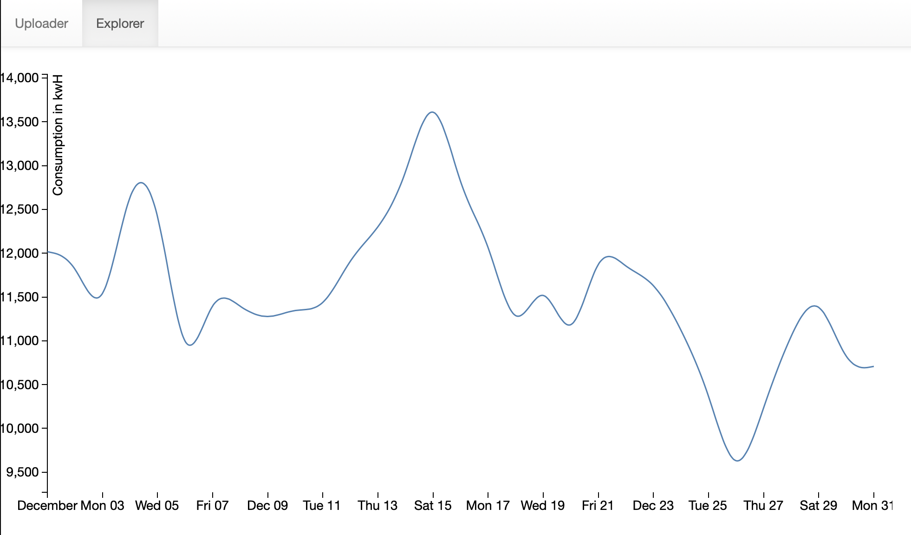

# Energy Data App

## Installation
1. Setup [miniconda](https://docs.conda.io/en/latest/miniconda.html)
2. Create a conda environment: `conda env create -n energy_data python=3.8`
3. `conda activate energy_data`
4. Setup [poetry](https://python-poetry.org)
5. `poetry install` (run at same level as pyproject.toml and poetry.lock)
6. Initialize the database in PSQL shell:
```
psql
CREATE USER postgres SUPERUSER;
CREATE USER energydbuser WITH PASSWORD '1234';
CREATE DATABASE energydb WITH OWNER = postgres;
GRANT ALL PRIVILEGES ON DATABASE energydb to energydbuser;
ALTER ROLE energydbuser SET client_encoding TO 'utf8';
ALTER ROLE energydbuser SET default_transaction_isolation TO 'read committed';
ALTER ROLE energydbuser SET timezone TO 'UTC';
ALTER USER energydbuser CREATEDB;
exit;
```
7. `python manage.py migrate` (run at same level as manage.py)
8. `python manage.py runserver` (run at same level as manage.py)

## App Description

### Uploader Page:
Use this page to upload the CSVs.
The CSVs must be imported in the following order:

1. Buildings
2. Meters
3. Consumption data

The app will stop a user from uploading out of order by checking that the necessary relationship exists
before saving the entry.
The backend looks for the necessary keys in the CSV to then save to the database.
These keys can be updated in `common/views.py` in the `keys_to_find` variables for each CSV.
NOTE: The Consumption CSV upload is very slow. This could be improved with Django's `bulk_create` and a bit of refactoring.
Additionally, if the the upload request was not dependent on a redirect (ideal case for API), this could become an async process
and no longer block the user.

### Explore Pages:
These table pages run on [django-tables2](https://django-tables2.readthedocs.io/en/latest/)
By clicking the header of a certain column, you can sort the table by ascending and descending.

#### The Building explore page
If you click the `id` of a building, the app will take you to a table showing that building's meter data.
If you click the `name` of a building, a visual will render on a new page showing that building's kwH usage over time.

#### The Meter explore page
If you click the `id` of a meter, the app will take you to a table showing that meters's consumption data.

#### The Consumption explore page
This page displays all of a certain meter's consumption data.

#### Visualization page
The visualization pages show any given building's combined electricity and natural gas usage per day.
Click the `name` field on the explore page to see the visual.
I decided that showing the kwH of each building would provide the most helpful visual because these example CSVs have no water data.

